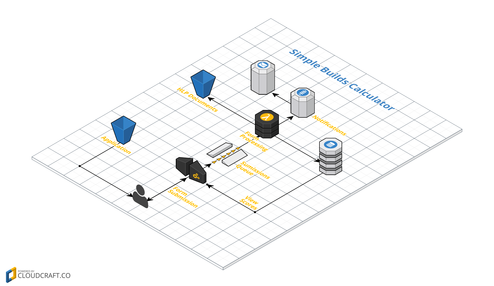

# EMEA Build Hackday

## Overview
The inaugural hackday for the FAWS EMEA Build team is intended to achieve the following:

* Increase team exposure to the AWS platform around key but infrequently touched technologies
* Provide a centralised (non-Excel) alternative for Simple Build calculations with support for versioning

There are two main components to the hackday, the serverless application and the supporting AWS infrastrcuture. Groups should be created to work on each of these areas with owners agreed for each of the distinct tasks that come out of the design session. 

The suggested agenda for the day is:

- **09:00** - Google Campus opens its doors. 
- **09:15** - Beverages are secured and hackday project discussion and design start.
- **~~10:00~~ 11:00** - Russell arrives and buys everyone drinks as penance. 
- **12:00** - Lunch of some sort (facilities uncertain) and regroup.
- **13:00** - Back at it for further awesomeness. 
- **16:00** - Wrap-up with final update from team.
- **16:30** - Drinks

### Working Structure
To ensure we're all working in roughly the same way the following is recommended:

1. Ideas for discussion, development, or change, should be raised as issues on the GitHub repository
1. Branches should be created for each issue and issues should focus on distinct elements of functionality
1. Each engineer or group (Where paired coding) should work in a branch and never in master
1. Pull requests should be used to merge branches into the master branch
1. All supporting documentation for this project should exist in the repository

### Project Goals

- To produce a Single Page Application (SPA) to replace the existing Excel spreadsheet
- Allow the SA community to get instant feedback on build complexity 
- Support submission of simple build score, product breakdown, and customer details
- Provide notification functionality to allow for build team notifciation on submission
- Act as a reference serverless architecture for the team

## Suggested next steps
The below can be viewed as discussion points for the design session or as a check list during development. 

### Application

- Add submission functionality to Application
- Architecture review should support colours coding as per the Excel documentation
- Improvide review page with visualisation component
- Use Rackspace's Canon styling framework

### Infrastructure

- Agree AWS products required to support the functionality outlined in the *Project Goals*
- Using software of your choice create an architectural design 
- Decide on API structure to support the application functionality
- Agree Lambda functions to be created and the functionality they are intended to support
- Decide if a datastore is required and if so which one
- Which notification solutions are best fit for the *Project Goals* and what third party integrations would add value?

## Reference 

- [AWS Zombie Lambda Workshop](https://github.com/awslabs/aws-lambda-zombie-workshop)
- [Rackspace Canon Framework](http://rackerlabs.github.io/canon/get-started/)
- [GraphQL](http://graphql.org/)
